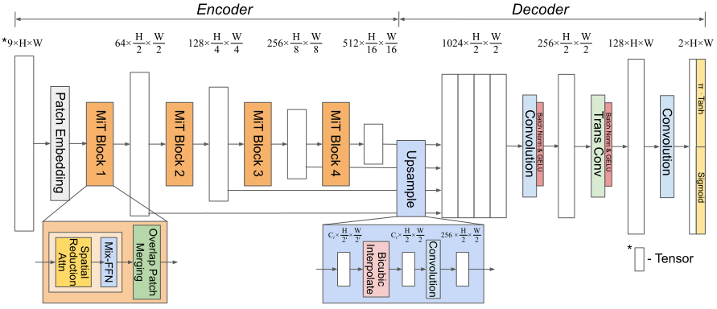

# PtychoFormer: A Transformer-based Model for Ptychographic Phase Retrieval

## Overview

PtychoFormer is a deep learning model designed for fast and accurate phase retrieval in ptychographic imaging. By leveraging a transformer-based architecture, PtychoFormer processes diffraction patterns efficiently, allowing for real-time imaging applications while maintaining high-quality phase reconstructions. 

The model achieves its speed and accuracy by combining a Transformer Encoder for feature extraction and a Convolutional Decoder for image reconstruction. This architecture allows PtychoFormer to capture global context from diffraction patterns, making it more robust to sparse scans compared to traditional iterative methods. 

Paper: [arXiv:2410.17377](https://arxiv.org/abs/2410.17377)

### Reconstruction Framework

The following diagram provides an overview of the entire reconstruction process from (a) generating diffraction patterns to (b) final retrieved phase using PtychoFormer  and extended-PtychoFormer (c):


### Model Architecture

The detailed architecture of the PtychoFormer model is shown below:



## Instructions

### 1. Download the Source Datasets
The datasets required for this project are too large to be included directly. To download the datasets, follow these steps:

- Navigate into the `data_source` folder.
- Inside the folder, you will find three subfolders: `Flickr30k`, `Caltech101`, and `Flower102`.
- For each subfolder:
  - Open the respective Python notebook provided in the subfolder.
  - Run the notebook to download the dataset.

### 2. Process the Datasets
Once the datasets are downloaded, you need to pre-process them.

- Navigate into the `data_processing` folder.
- Run the `data_processing.ipynb` notebook to process the datasets.

### 3. Unzip Model Weights
Model weights are stored inside `weights.tar.gz` and must be extracted before using it.

- Navigate into `Models` and run the following command in your terminal:

  ```bash
  tar -xzvf weights.tar.gz

### 4. Train the Model
After processing the datasets, you can train the model.

- Make sure you are in the parent directory of the project.
- Run the following command in your terminal:

  ```bash
  python -m training.train
